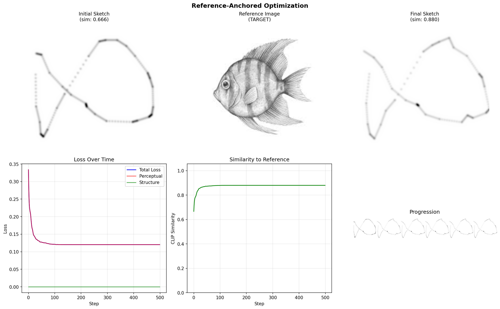

# Inverse CLIPasso: Exploring Sketch Quality Enhancement

## Abstract

This research explores methods for improving the quality of rough sketches (specifically QuickDraw doodles) using CLIP-guided optimization and neural network approaches. We investigated whether techniques from CLIPasso—which transforms photographs into abstract sketches—could be "inverted" to transform rough sketches into refined ones. Our findings reveal fundamental limitations of CLIP-based optimization for sketch enhancement and suggest more promising directions using learned image-to-image translation.

---

## 1. Introduction

### 1.1 Motivation

The QuickDraw dataset contains millions of human-drawn sketches, but their quality varies dramatically. Some sketches are barely recognizable while others are quite detailed. The goal of this project is to explore whether we can automatically improve sketch quality—transforming a rough, amateur doodle into a cleaner, more refined sketch.

### 1.2 Research Questions

1. Can CLIP-guided optimization improve sketch quality while preserving semantic content?
2. How effective is the original CLIPasso approach when inverted (sketch → better sketch instead of photo → sketch)?
3. Can neural networks learn to enhance sketches through image-to-image translation?

### 1.3 Background: CLIPasso

CLIPasso (Vinker et al., 2022) is a method for creating abstract sketches from photographs. It works by:
- Starting with random strokes
- Rendering strokes differentiably
- Optimizing stroke positions to maximize CLIP similarity to the target photo
- Using perceptual loss from CLIP's intermediate layers to preserve structure

Our hypothesis was that this process could be inverted: instead of photo → sketch, we could optimize sketch → better sketch.

---

## 2. Methods

### 2.1 Approach 1: Text-Guided CLIP Optimization

**Hypothesis**: Optimizing a sketch's CLIP similarity to text descriptions like "a perfect sketch of a fish" would improve sketch quality.

**Implementation**:
- Differentiable soft-line renderer using Gaussian splatting
- CLIP ViT-B/32 for semantic encoding
- Adam optimizer with various learning rate schedules
- Multiple prompt templates averaged for robustness

**Configuration**:
```python
OptimizationConfig(
    label="a perfect sketch of a fish",
    steps=1500,
    lr=2.5,
    use_multi_prompt=True,
    use_augmentations=True,
    use_bezier=True,
)
```

### 2.2 Approach 2: Reference Image Anchoring

**Hypothesis**: Using a high-quality reference sketch as the optimization target (instead of text) would provide stronger guidance.

**Implementation**:
- Pre-compute CLIP embedding of reference image (perfectFish.jpeg)
- Optimize QuickDraw sketch to maximize similarity to reference embedding
- Structure preservation loss to prevent shape collapse

**Configurations tested**:
| Structure Weight | Description |
|-----------------|-------------|
| 0.0 | Pure reference matching |
| 0.3 | Balanced |
| 0.7 | Heavy structure preservation |

### 2.3 Approach 3: Neural Network (Pix2Pix Style)

**Hypothesis**: A U-Net trained on paired (degraded, clean) sketches could learn to enhance sketch quality.

**Implementation**:
- U-Net generator (54M parameters)
- Synthetic training pairs from QuickDraw:
  - Input: Degraded sketches (noise, simplification, jitter)
  - Target: Original QuickDraw sketches
- L1 reconstruction loss
- 500 fish samples, 15 epochs

### 2.4 Additional Techniques Explored

- **Bézier Curve Representation**: Converting polyline strokes to cubic Bézier curves for smoother optimization
- **CLIP Augmentations**: Random crops, perspective transforms, and rotations during CLIP encoding
- **Multi-scale Perceptual Loss**: Using intermediate CLIP layer features
- **Progressive Stroke Addition**: Dynamically adding strokes during optimization

---

## 3. Results

### 3.1 Text-Guided CLIP Optimization

| Metric | Initial | Final | Change |
|--------|---------|-------|--------|
| CLIP Similarity | 23.8% | 24.8% | +1.0% |
| Visual Quality | Fish shape | Collapsed blob | ❌ Degraded |

**Observation**: The sketch collapsed into a small cluster of strokes. Despite marginal CLIP similarity improvement, the visual quality dramatically decreased.


### 3.2 Reference Image Anchoring

| Structure Weight | Initial Sim | Final Sim | Visual Result |
|-----------------|-------------|-----------|---------------|
| 0.0 | 66.6% | **88.0%** | Shape collapsed toward circular |
| 0.3 | 66.6% | 70.7% | Moderate distortion |
| 0.7 | 66.6% | 68.3% | Shape preserved, minimal change |

**Key Finding**: Higher CLIP similarity did NOT correlate with better visual quality. The 88% similarity case (structure_weight=0.0) produced the worst visual result.



### 3.3 Neural Network Training

| Epoch | Train L1 Loss | Val L1 Loss |
|-------|--------------|-------------|
| 1 | 0.416 | 0.273 |
| 5 | 0.133 | 0.135 |
| 15 | 0.129 | 0.131 |

**Observation**: The model converged but produced nearly blank outputs. The synthetic degradations were too subtle—the model learned to output "safe" near-white values rather than meaningful transformations.

---

## 4. Analysis and Discussion

### 4.1 Why CLIP Optimization Fails for Sketch Enhancement

The fundamental issue is that **CLIP measures semantic similarity, not visual quality**. 

Consider two sketches of a fish:
- Sketch A: A simple 5-stroke outline
- Sketch B: A detailed 50-stroke sketch with scales and fins

Both might have similar CLIP similarity to "fish" because they both represent the same semantic concept. CLIP cannot distinguish between:
- A well-drawn fish
- A poorly-drawn fish
- A fish-shaped blob

**The gradient signal is uninformative**: CLIP tells the optimizer "this is fish-like" but not "add more detail here" or "smooth this line."

### 4.2 The Structure vs. Similarity Tradeoff

Our reference-anchored experiments revealed a paradox:

```
Higher CLIP similarity → Lower visual quality
```

This occurs because:
1. The reference sketch (perfectFish.jpeg) has rich detail that cannot be achieved with 5-8 simple strokes
2. The optimizer finds that collapsing strokes into a compact shape increases overall "fish-ness" in CLIP space
3. Without structure constraints, the optimizer destroys the original sketch's recognizable features

### 4.3 Why Neural Network Training Produced Blank Outputs

The pix2pix approach failed because:
1. **Insufficient degradation contrast**: Noise and simplification didn't create enough difference between input and target
2. **L1 loss encourages averaging**: When uncertain, the model outputs gray/white (the mean pixel value)
3. **No adversarial loss**: A discriminator would penalize blank outputs

### 4.4 Comparison: CLIPasso vs. Inverse CLIPasso

| Aspect | CLIPasso (Photo → Sketch) | Inverse CLIPasso (Sketch → Better Sketch) |
|--------|--------------------------|------------------------------------------|
| **Source** | Rich, detailed photo | Simple, sparse strokes |
| **Target** | Abstract representation | Detailed representation |
| **Direction** | Simplification | Enhancement |
| **Visual anchor** | Strong (photo provides structure) | Weak (no ground truth) |
| **Feasibility** | ✅ Works well | ❌ Fundamentally limited |

**Key Insight**: CLIPasso works because the photo provides a strong perceptual anchor—the sketch must "look like" the photo. Inverse CLIPasso lacks this anchor; there's no clear definition of what a "better" sketch should look like.

---

## 5. Key Findings

### 5.1 CLIP Similarity ≠ Visual Quality

This is the most important finding. CLIP embeddings capture semantic content but not aesthetic quality. A crumpled piece of paper with "fish" written on it might have similar CLIP similarity to "fish" as a beautiful fish illustration.

### 5.2 Sketch Enhancement Requires Different Approaches

Unlike sketch abstraction (CLIPasso), sketch enhancement likely requires:
- **Learned priors** about what "good" sketches look like
- **Paired training data** (rough sketch, refined sketch)
- **Style transfer** rather than semantic optimization

### 5.3 Structure Preservation is Critical but Insufficient

Adding structure preservation loss prevents collapse but doesn't enable improvement. It creates a tradeoff:
- High structure weight → Sketch unchanged
- Low structure weight → Sketch destroyed

There's no "sweet spot" that achieves both preservation AND enhancement.

---

## 6. Future Directions

### 6.1 Better Training Data for Neural Approaches

Instead of synthetic degradation:
- Collect real paired data (artist's rough draft → final sketch)
- Use different artists' interpretations of the same prompt
- Apply stronger, more realistic degradations

### 6.2 Style Transfer Approaches

Rather than "improving" a sketch, transfer the style of exemplar sketches:
- Neural style transfer adapted for line drawings
- Sketch-specific GAN architectures (e.g., SketchHealer)

### 6.3 Stroke-Level Learning

Instead of pixel-level optimization:
- Learn which strokes to add, remove, or modify
- Reinforcement learning for stroke editing
- Differentiable stroke editing operations

### 6.4 Hybrid Approaches

Combine multiple signals:
- CLIP for semantic preservation
- Discriminator for "sketch-like" appearance  
- Exemplar loss for style guidance
- Structure loss for shape preservation

---

## 7. Conclusion

Our exploration of "Inverse CLIPasso" reveals that **sketch enhancement is fundamentally different from sketch abstraction**. While CLIP-guided optimization successfully creates abstractions from photos (by having a strong visual anchor), it cannot improve sketch quality because:

1. CLIP similarity measures semantics, not aesthetics
2. Optimization without visual anchors leads to shape collapse
3. The problem requires learned priors about sketch quality

For practical sketch enhancement, we recommend neural network approaches with:
- Real paired training data
- Adversarial losses
- Strong degradation/clean contrasts

This research contributes to understanding the limitations of CLIP-guided visual optimization and highlights the importance of matching optimization objectives to desired outcomes.

---

## 8. Code and Artifacts

### Repository Structure
```
doodleBot/
├── src/inverse_clipasso/
│   ├── clip/           # CLIP model wrapper
│   ├── render/         # Differentiable renderers (soft lines, Bézier)
│   ├── optimize/       # Optimization algorithms
│   │   ├── inverse_clipasso.py    # Main optimizer
│   │   ├── clipasso_optimizer.py  # CLIPasso-style optimizer
│   │   ├── augmentations.py       # CLIP augmentations
│   │   └── perceptual_loss.py     # Multi-scale loss
│   ├── models/         # Neural network models
│   │   └── sketch_enhancer.py     # U-Net for sketch enhancement
│   └── data/           # Data loading utilities
├── tests/              # Experiment scripts
├── outputs/            # Generated results
└── scripts/            # Training scripts
```

### Key Experiments
- `tests/test_long_optimization.py` - Text-guided CLIP optimization
- `tests/test_reference_anchor.py` - Reference image anchoring
- `scripts/train_sketch_enhancer.py` - Neural network training

### Saved Results
- `outputs/long_optimization/` - CLIP optimization results
- `outputs/reference_anchor/` - Reference anchoring results
- `outputs/sketch_enhancer/` - Neural network training artifacts

---

## References

1. Vinker, Y., et al. (2022). "CLIPasso: Semantically-Aware Object Sketching." ACM SIGGRAPH.
2. Radford, A., et al. (2021). "Learning Transferable Visual Models From Natural Language Supervision." ICML.
3. Isola, P., et al. (2017). "Image-to-Image Translation with Conditional Adversarial Networks." CVPR.
4. Ha, D., & Eck, D. (2018). "A Neural Representation of Sketch Drawings." ICLR.

---

*Research conducted as part of [Course Name] at [University Name], December 2024.*

